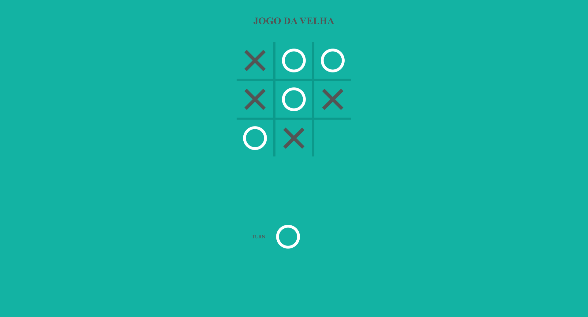

# jogo_da_velha

É um jogo da velha que foi desenvolvido com HTML, CSS e Javascript.

A logica do jogo consiste em: existe um array com 9 espacos vazios, sempre que o usuario clicar em um espaço vazio, sera atribuido o valor "x" ou "O" baseado em quem for o jogador atual. Na verificação de quem ganhou, existe um array bi-dimensional contendo todas as possiveis vitorias, ou seja todas as possibilidades, verticais, horizontais e diagonais.

[visualizar](https://williamribeir0.github.io/jogo_da_velha/)

